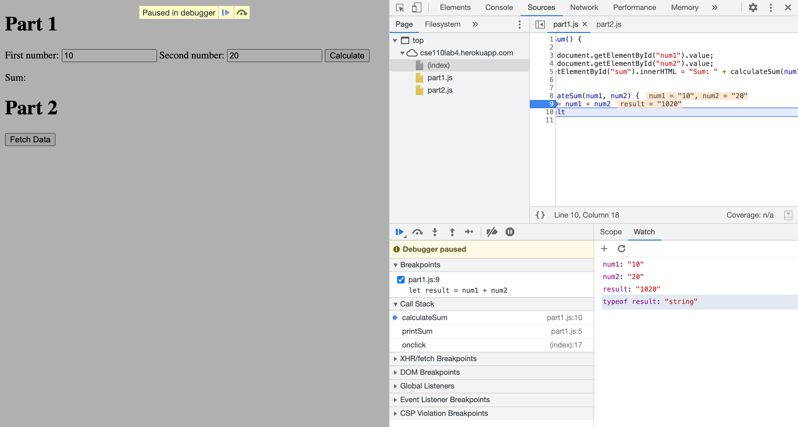

## Lab4 - part 3

1. The `printSum` function reads `num1` and `num2` as string, so when adding these two inside the `calculateSum` function, it instead concatenates `num1` and `num2`.
   
2. Change the type of `num1` and `num2` to Number when we add them up.  

3. **citylots.json**

4. **part2.js**

5. Content-Length: **11687628** bytes

6. Content Download: **76.69** ms

7. User-Agent: **Mozilla/5.0 (Macintosh; Intel Mac OS X 10_15_7) AppleWebKit/537.36 (KHTML, like Gecko) Chrome/90.0.4430.72 Safari/537.36**

8. Server: **Apache**

9. Last-Modified: **Tue, 26 Jan 2021 22:14:13 GMT**

10. Content-Type: **application/json**

11. **fetchData**(part2.js:2) and **onclick**((index):21)